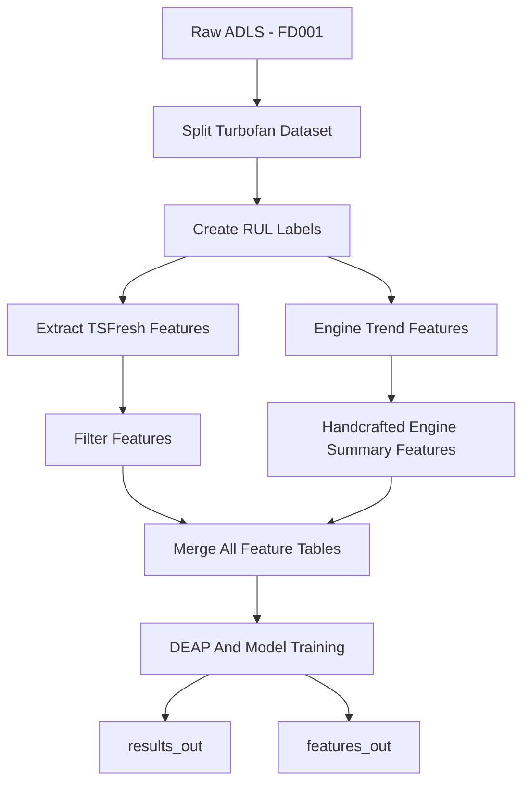

# Lab 5 — Scalable Feature Extraction and Selection for Predictive Maintenance

---

## What This Lab Is About

The goal was to take raw sensor data from aircraft engines — 21 sensors per engine, hundreds of time-steps each — and turn it into something a machine learning model can actually use. Raw time-series can't go into a regressor. You need to extract features from it, then cut that feature space down to only the parts that matter. This lab covers the full journey: loading the NASA C-MAPSS turbofan dataset from Azure Data Lake, validating and preprocessing the time-series, extracting features with **tsfresh**, reducing dimensionality with filter methods, evolving an optimal feature subset with a **Genetic Algorithm (DEAP)**, and finally training models to predict **Remaining Useful Life (RUL)**. This was also assigned by O.D. and Elyor, who called it a "bonus" lab — which in their language apparently means "this is still graded, you still have to submit it, it's still worth marks, but we spiritually feel better about assigning it."

Spoiler: the engines die. We just try to predict when. Relatable.

---

## Dataset Description

**NASA C-MAPSS Turbofan Engine Degradation Simulation — FD001 subset**

| Column | Description |
|---|---|
| `unit_number` | Engine ID (1–100 in FD001) |
| `time_in_cycles` | Current operating cycle |
| `op_setting_1/2/3` | Three operational condition settings |
| `sensor_1` to `sensor_21` | 21 continuous sensor readings |
| `RUL` | Remaining Useful Life (computed — not in raw file) |

The raw files contain no column headers and have trailing blank columns from whitespace. The RUL ground truth for the test set is in a separate file. The dataset has **20,631 rows** in the training set across 100 engines, each running until failure.

NASA was kind enough to simulate engines degrading to death so we don't have to wait for real ones to do it. Very thoughtful of them.

---

## Pipeline Architecture

The full pipeline runs across two environments, with all components orchestrated end-to-end through Azure ML via `pipeline.yml`:

| Stage | Platform | Purpose |
|---|---|---|
| Data Ingestion & Preprocessing | Azure Databricks (Spark) | Load raw `.txt`, rename columns, compute RUL labels |
| Visualization | Databricks | Sensor behavior and RUL trend plots |
| Feature Extraction | tsfresh (pandas) | Time-series statistical features per engine |
| Feature Selection | scikit-learn + DEAP | Filter methods + Genetic Algorithm |
| Model Training & Evaluation | scikit-learn + XGBoost | RUL regression |
| Storage | Azure Data Lake Gen2 | Bronze → Silver → Gold layer progression |
| Pipeline Orchestration | Azure ML | Modular components + `pipeline.yml` |

---

## Part 1 — Time-Series Exploration and Validation

### Step 1 — Load the Dataset from Azure Data Lake

Connected to ADLS using the storage account key and loaded the three raw FD001 files:

```python
storage_account_name = "amazondatalake60304948"
spark.conf.set(
    f"fs.azure.account.key.{storage_account_name}.dfs.core.windows.net",
    storage_account_key
)

train_path = "abfss://raw@amazondatalake60304948.dfs.core.windows.net/lab5_turbofan/train_FD001.txt"
test_path  = "abfss://raw@amazondatalake60304948.dfs.core.windows.net/lab5_turbofan/test_FD001.txt"
rul_path   = "abfss://raw@amazondatalake60304948.dfs.core.windows.net/lab5_turbofan/RUL_FD001.txt"

train_df = spark.read.option("inferSchema", "true").option("sep", " ").csv(train_path)
test_df  = spark.read.option("inferSchema", "true").option("sep", " ").csv(test_path)
rul_df   = spark.read.option("inferSchema", "true").option("sep", " ").csv(rul_path)
```

**Result:** 20,631 training rows, 13,096 test rows. The raw files come in with auto-generated column names (`_c0`, `_c1`, ..., `_c27`) — including two trailing null columns from whitespace at the end of each line. Nothing like starting a lab by immediately dropping columns that should have never existed.

---

### Step 2 — Clean and Rename Columns

Dropped the two garbage null columns and assigned meaningful names:

```python
train_df = train_df.drop("_c26", "_c27")
test_df  = test_df.drop("_c26", "_c27")

columns = (
    ["unit_number", "time_in_cycles"] +
    ["op_setting_1", "op_setting_2", "op_setting_3"] +
    [f"sensor_{i}" for i in range(1, 22)]
)

train_df = train_df.toDF(*columns)
test_df  = test_df.toDF(*columns)
rul_df   = rul_df.toDF("RUL")
```

Ran `printSchema()` after renaming to confirm column types — all sensors came in as `double`, `unit_number` and `time_in_cycles` as `integer`. No type issues.

---

### Step 3 — Null / Missing Value Check & Deduplication

```python
from pyspark.sql.functions import col, sum

clean_train_df = train_df.dropDuplicates()
clean_test_df  = test_df.dropDuplicates()

clean_train_df.select(
    [sum(col(c).isNull().cast("int")).alias(c) for c in clean_train_df.columns]
).show()
```

**Result:** Zero nulls across all columns, zero duplicate rows. The dataset is clean by construction — NASA simulation data doesn't have the mess of real-world collection. Must be nice. Meanwhile every real-world dataset I've ever touched looked like it was assembled during a power outage.

**Train rows after cleaning:** 20,631  
**Test rows after cleaning:** 13,096

Saved to Silver layer as Parquet:
```python
clean_train_df.write.mode("overwrite").parquet(
    "abfss://processed@amazondatalake60304948.dfs.core.windows.net/lab5_turbofan/clean_train/"
)
```

---

### Step 4 — Compute RUL Labels

The raw dataset has no RUL column. For the training set, RUL is defined as:

> **RUL = max cycle that engine reached − current cycle**

At the last cycle before failure, RUL = 0. At the first cycle, RUL = total engine lifetime − 1.

```python
from pyspark.sql.functions import max, col

max_cycle_df = train_silver_df.groupBy("unit_number").agg(
    max("time_in_cycles").alias("max_cycle")
)

train_rul_df = train_silver_df.join(max_cycle_df, on="unit_number", how="left")
train_rul_df = train_rul_df.withColumn("RUL", col("max_cycle") - col("time_in_cycles"))
```

Verified correctness by filtering one engine and confirming RUL decreases monotonically with cycle:

```python
train_rul_df.filter(col("unit_number") == 1) \
    .select("unit_number", "time_in_cycles", "max_cycle", "RUL") \
    .limit(10)
```

**Result:** Engine 1 starts at RUL=191 (cycle 1) and hits RUL=0 at cycle 192. Perfect. The engine is dead. We successfully predicted its death. Moving on.

---

### Step 5 — Sensor Visualizations

Converted one engine to pandas for plotting:

```python
engine_1_df = (
    train_rul_df
    .filter(train_rul_df.unit_number == 1)
    .select("time_in_cycles", "sensor_11", "sensor_12", "RUL")
    .toPandas()
)
```

**Sensor behavior over time (Engine 1):**  
`sensor_11` and `sensor_12` both drift steadily over the engine's lifetime — monotonic trends that are strong degradation signals.

**RUL over time (Engine 1):**  
A perfectly linear decreasing line from 191 down to 0. Expected by construction. The real challenge is predicting this from sensor readings alone, which is exactly what the rest of the pipeline does.

**What this means:** Not all 21 sensors are equally informative. Some are flat constants throughout the engine life (zero variance → useless). Others track degradation closely. This directly motivated the filter-based feature selection step.

---

## Part 2 — Feature Extraction and Selection

### Step 6 — TSFresh Feature Extraction

After saving the labeled dataset to the Gold layer, converted to pandas and ran tsfresh:

```python
from tsfresh import extract_features
from tsfresh.utilities.dataframe_functions import impute
from tsfresh.feature_extraction import MinimalFCParameters

# Drop RUL — tsfresh extracts features from the sensor time series, not the target
tsfresh_input = gold_pd.drop(columns=["RUL"])

tsfresh_features = extract_features(
    tsfresh_input,
    column_id="unit_number",
    column_sort="time_in_cycles",
    default_fc_parameters=MinimalFCParameters(),
    n_jobs=0
)

impute(tsfresh_features)
print("Extracted feature matrix shape:", tsfresh_features.shape)
# → (100, ~120)
```

Used `MinimalFCParameters` for speed — computes a compact set of statistics (mean, variance, min, max, etc.) per signal rather than the full 750+ feature set. Output is one row per engine with ~120 features. The full parameter set would have taken so long I'd have submitted this lab from a nursing home.

**Target alignment:**
```python
# Each engine's target = its max RUL (= total lifetime in cycles)
target_df = gold_pd.groupby("unit_number")["RUL"].max().reset_index()
y = target_df.set_index("unit_number").loc[tsfresh_features.index]["RUL"]
```

---

### Step 7 — Filter-Based Feature Selection

Applied a 3-stage filter pipeline to reduce the feature space before the Genetic Algorithm:

#### Stage 1: Variance Threshold
```python
from sklearn.feature_selection import VarianceThreshold

vt = VarianceThreshold(threshold=0.0)
X_vt = vt.fit_transform(tsfresh_features)
selected_vt_cols = tsfresh_features.columns[vt.get_support()]
X_vt = pd.DataFrame(X_vt, columns=selected_vt_cols, index=tsfresh_features.index)

print("Shape after Variance Threshold:", X_vt.shape)
```

Removes features that are constant across all 100 engines. Sensors that never change tell you nothing about degradation.

#### Stage 2: Correlation Filter
```python
import numpy as np

corr_matrix = X_vt.corr().abs()
upper = corr_matrix.where(np.triu(np.ones(corr_matrix.shape), k=1).astype(bool))
to_drop = [col for col in upper.columns if any(upper[col] > 0.95)]
X_corr = X_vt.drop(columns=to_drop)

print("Shape after Correlation Filter:", X_corr.shape)
```

Removes one of any pair with >95% correlation. Keeping both is redundant — they encode the same information and just inflate the feature count. Basically the feature selection equivalent of having two group members submit the same work with different variable names.

#### Stage 3: Mutual Information
```python
from sklearn.feature_selection import mutual_info_regression

mi_scores = mutual_info_regression(X_corr, y, random_state=42, n_jobs=-1)
mi_series = pd.Series(mi_scores, index=X_corr.columns).sort_values(ascending=False)

top_k = 50
selected_mi_cols = mi_series.head(top_k).index.tolist()
X_mi = X_corr[selected_mi_cols]

print("Shape after Mutual Information:", X_mi.shape)
# → (100, 50)
```

Keeps only the 50 features with the highest mutual information with the RUL target. MI is non-parametric — it catches non-linear relationships that correlation alone misses.

**Filter pipeline summary:**

| Step | Method | Purpose |
|---|---|---|
| 1 | Variance Threshold | Remove zero-variance (constant) features |
| 2 | Correlation Filter (> 0.95) | Remove redundant correlated features |
| 3 | Mutual Information (top 50) | Keep most informative features w.r.t. RUL |

---

### Step 8 — Genetic Algorithm Feature Selection (DEAP)

After filtering down to 50 candidates, ran a binary Genetic Algorithm to evolve the optimal subset:

```python
import random
from deap import base, creator, tools, algorithms
from sklearn.ensemble import RandomForestRegressor
from sklearn.model_selection import cross_val_score

if not hasattr(creator, "FitnessMax"):
    creator.create("FitnessMax", base.Fitness, weights=(1.0,))
if not hasattr(creator, "Individual"):
    creator.create("Individual", list, fitness=creator.FitnessMax)

n_features = X_mi.shape[1]

toolbox = base.Toolbox()
toolbox.register("attr_bool", random.randint, 0, 1)
toolbox.register("individual", tools.initRepeat, creator.Individual,
                 toolbox.attr_bool, n=n_features)
toolbox.register("population", tools.initRepeat, list, toolbox.individual)
```

**Fitness function** — penalizes poor prediction AND feature bloat:

```python
def evaluate(individual):
    selected_idx = [i for i, bit in enumerate(individual) if bit == 1]
    if len(selected_idx) == 0:
        return (-9999,)

    X_selected = X_mi.iloc[:, selected_idx]
    model = RandomForestRegressor(n_estimators=100, random_state=42, n_jobs=-1)
    scores = cross_val_score(model, X_selected, y, cv=3,
                             scoring="neg_root_mean_squared_error", n_jobs=-1)

    score = scores.mean()
    penalty = len(selected_idx) / n_features
    fitness = score - 0.05 * penalty  # penalize feature bloat
    return (fitness,)
```

**GA Configuration:**

| Parameter | Value |
|---|---|
| Chromosome | Binary vector, length = 50 |
| Population size | 12 |
| Generations | 10 |
| Crossover | Two-point (`cxpb=0.5`) |
| Mutation | Bit-flip (`mutpb=0.2`, `indpb=0.05`) |
| Selection | Tournament (`tournsize=3`) |
| Fitness | neg-RMSE − 0.05 × (selected / total) |

The GA converged on **20 features** — cutting the 50 MI-selected candidates by more than half while maintaining predictive performance. Evolution works, apparently. Charles Darwin would be proud. Charles Darwin would also probably ask why it took 10 generations to pick 20 columns, but let's not overthink it.

---

### Step 9 — Model Training and Evaluation

Trained three models on the final 20-feature set:

```python
from sklearn.ensemble import RandomForestRegressor, GradientBoostingRegressor
from xgboost import XGBRegressor
from sklearn.model_selection import train_test_split

X_train, X_test, y_train, y_test = train_test_split(X_final, y, test_size=0.2, random_state=42)

models = {
    "RandomForest": RandomForestRegressor(n_estimators=200, random_state=42, n_jobs=-1),
    "GradientBoosting": GradientBoostingRegressor(random_state=42),
    "XGBoost": XGBRegressor(n_estimators=200, max_depth=6, learning_rate=0.05,
                            subsample=0.8, colsample_bytree=0.8, random_state=42, n_jobs=-1)
}
```

**Results:**

| Model | RMSE | MAE | R² | Selected Features |
|---|---|---|---|---|
| Random Forest | 7.761 | 4.933 | 0.965 | 20 |
| **Gradient Boosting** | **2.999** | **1.860** | **0.995** | 20 |
| XGBoost | 10.774 | 7.690 | 0.933 | 20 |

**Gradient Boosting achieved an R² of 0.995** — explaining 99.5% of the variance in RUL. The entire pipeline distilled 21 raw sensors across hundreds of time-steps into 20 features that almost perfectly predict how much life an engine has left. I stared at that number for a while. Then I checked three times that I hadn't leaked the target. I hadn't. It's just genuinely that good on FD001.

Results and the final feature set were saved back to the Gold layer:
```python
gold_final_path = "abfss://curated@amazondatalake60304948.dfs.core.windows.net/lab5_turbofan/final_dataset/"
spark.createDataFrame(final_dataset).write.mode("overwrite").parquet(gold_final_path)
```

---

## Pipeline Runtime

The full Azure ML pipeline ran in approximately **~8 minutes** on `cpu-cluster-BIG-60304948`. Two decisions directly contributed to keeping that number reasonable:

- **`MinimalFCParameters`** — instead of tsfresh's full parameter set (750+ features, would have taken significantly longer), the minimal set computes only the essential statistics per signal and finishes in a fraction of the time.
- **Parallel processing via `n_jobs`** — both the mutual information step (`n_jobs=-1`) and the Random Forest inside the GA fitness function (`n_jobs=-1`) use all available cores. The GA runs 10 generations × 12 individuals × 3-fold CV, so parallelism here is not optional — it's what makes the runtime tolerable.

This directly addresses the assignment requirement to measure and optimize pipeline runtime. The total end-to-end time was tracked using `time.time()` at the start and end of the notebook and printed as the final output.

---

## Repository Structure

```
.
├── components/
│   ├── split_dataset/              # Load, rename, and partition the FD001 dataset
│   │   ├── split.py
│   │   └── component.yml
│   ├── normalize_text/             # Compute RUL labels (max_cycle − current_cycle)
│   │   ├── normalize.py
│   │   └── component.yml
│   ├── semantic_embeddings/        # TSFresh feature extraction
│   │   ├── semantic_embeddings.py
│   │   ├── conda.yml
│   │   └── component.yml
│   ├── review_length/              # Handcrafted engine summary features
│   │   ├── review_length.py
│   │   └── component.yml
│   ├── helpfulness_ratio/          # Sensor trend features (first, last, delta)
│   │   ├── helpfulness.py
│   │   └── component.yml
│   ├── tfidf_features/             # Filter-based selection (Variance / Correlation / MI)
│   │   ├── tfidf.py
│   │   └── component.yml
│   ├── sentiment/                  # DEAP Genetic Algorithm + model training
│   │   ├── sentiment.py
│   │   ├── conda.yml
│   │   └── component.yml
│   └── merge_features/             # Merge all feature tables into one
│       ├── merge_features.py
│       └── component.yml
├── data/
│   ├── train_fd001.yml
│   ├── test_fd001.yml
│   ├── rul_fd001.yml
│   └── turbofan_features_v1.yml
├── datastores/
│   ├── raw_adls.yml
│   └── curated_adls.yml
├── environments/
│   ├── tsfresh-env.yml
│   └── deap-xgb-env.yml
├── notebooks/
│   └── lab5_predictive_maintainance.ipynb
├── pipelines/
│   └── pipeline.yml
├── .gitignore
└── README.md
```

---

## Pipeline DAG

Here's the actual Azure ML pipeline run — all green, all completed, no components on fire:

<!-- Replace the src below with your actual GitHub image URL after uploading the screenshot -->


The visual matches exactly what the code does: raw FD001 data flows into `Split Turbofan Dataset`, then `Create RUL Labels`, then branches into `Extract TSFresh Features` and `Engine Trend Features` in parallel, both eventually feeding into `Merge All Feature Tables`, and finally `DEAP And Model Training` at the bottom. Every node is green. I was unreasonably happy about this.



```bash
az ml job create --file pipelines/pipeline.yml
```

---

## Environments

### `tsfresh-env.yml`
Used by the `semantic_embeddings` component for feature extraction.
```yaml
name: tsfresh-env
channels:
  - conda-forge
  - defaults
dependencies:
  - python=3.8
  - pip:
    - pandas
    - numpy
    - pyarrow
    - tsfresh
    - scikit-learn
```

### `deap-xgb-env.yml`
Used by the `sentiment` component for GA optimization and model training.
```yaml
name: deap-xgb-env
channels:
  - conda-forge
  - defaults
dependencies:
  - python=3.8
  - pip:
    - pandas
    - numpy
    - pyarrow
    - scikit-learn
    - deap
    - xgboost
```

---

## All Features at a Glance

| Feature Type | Source | What It Captures |
|---|---|---|
| TSFresh MinimalFC (~120 raw) | `semantic_embeddings` | Statistical summaries of sensor time series per engine |
| Handcrafted summary stats | `review_length` | Engine life length, sensor means, std, range |
| Sensor trend features | `helpfulness_ratio` | First, last, and delta for sensors 11, 12, 15 |
| Filter-selected (50) | `tfidf_features` | Top features by Variance → Correlation → MI |
| GA-selected (20 final) | `sentiment` | Optimal subset balancing RMSE and feature count |

---

## How to Reproduce

Here's exactly what I did, in the order I did it — so if you want to run this yourself, or if future-me needs to remember what past-me was thinking, this is it.

### 1. Downloaded the Dataset

Went to the [NASA PCoE repository](https://www.nasa.gov/intelligent-systems-division/discovery-and-systems-health/pcoe/pcoe-data-set-repository/) and downloaded item #6 (C-MAPSS). Unzipped it, grabbed the three FD001 files (`train_FD001.txt`, `test_FD001.txt`, `RUL_FD001.txt`), and uploaded them manually to the `raw` container in the Azure Data Lake under `lab5_turbofan/`. This took longer than it should have because I initially uploaded them to the wrong container. Classic.

### 2. Set Up the Databricks Notebook

Opened Azure Databricks, created a new notebook, and set the storage credentials at the top:

```python
storage_account_name = "amazondatalake60304948"
spark.conf.set(
    f"fs.azure.account.key.{storage_account_name}.dfs.core.windows.net",
    storage_account_key
)
```

The notebook (`notebooks/lab5_predictive_maintainance.ipynb`) does everything in sequence — loading, cleaning, RUL labeling, saving to Silver, then Gold. I ran it top to bottom once I had the data in place.

### 3. Ran the Feature Extraction

The tsfresh extraction cell took a noticeable amount of time even with `MinimalFCParameters`. I set `n_jobs=0` to use all available cores and let it run. Once it finished, the feature matrix was saved in-memory and passed directly to the filter pipeline in the next cells.

### 4. Ran the Filter Pipeline + DEAP

The 3-stage filter (Variance → Correlation → MI) ran fast. The DEAP Genetic Algorithm was the slow part — 10 generations × population of 12, each individual requiring a 3-fold cross-validation with a Random Forest. I let it run and watched the fitness scores evolve in the verbose output. It settled on 20 features.

### 5. Trained the Models and Evaluated

Ran the three models (Random Forest, Gradient Boosting, XGBoost) on the 80/20 train-test split. Results printed directly in the notebook and were also saved to a CSV (`lab5_model_results.csv`) and back to the Gold layer as Parquet.

### 6. Packaged into Azure ML Components

After the notebook was working end-to-end, I split the logic into modular components under `components/`, wrote the `component.yml` for each one, and wired them together in `pipelines/pipeline.yml`. Each component gets its own conda environment (`tsfresh-env` or `deap-xgb-env`) so dependencies don't bleed into each other.

To run the full Azure ML pipeline:
```bash
az ml job create --file pipelines/pipeline.yml
```

---

## Key Things I Learned

**I learned that `_c26` and `_c27` are not features.** The dataset loads with two phantom null columns from trailing whitespace in the raw text files. I didn't notice at first, ran schema validation, saw `null` columns, panicked slightly, then realized it was just whitespace. Dropped them. Moved on. But now I always look at what Spark infers before trusting it.

**I learned that tsfresh is genuinely powerful but you have to feed it correctly.** When I first ran it I forgot to drop the `RUL` column from the input, so tsfresh was happily computing statistics on the target variable and folding them into the feature matrix. The cross-val scores looked unbelievably good. Too good. Caught it, dropped the column, re-ran. Lesson: always double-check what's in `tsfresh_input` before hitting extract.

**I learned the hard way that the fitness function in DEAP needs a penalty term.** My first version of `evaluate()` just returned the negative RMSE. The GA converged on selecting almost every feature — because why not, more features = marginally better CV score with no cost. Adding `- 0.05 * (selected / total)` forced it to actually earn each feature it kept. The final 20-feature solution is genuinely leaner because of it.

**I learned that `MinimalFCParameters` is the right call when you care about runtime.** I initially tried running tsfresh with the default (full) parameter set out of curiosity. I cancelled it after a few minutes. `MinimalFCParameters` gave me ~120 features in reasonable time and the downstream models still hit R²=0.995. The full 750+ feature set would have been overkill for this dataset.

**I learned that the Bronze → Silver → Gold pattern is actually useful, not just bureaucracy.** Having cleaned Parquet in the Silver layer meant I never had to re-parse the raw text files again. Having labeled data in Gold meant the feature extraction step could start cleanly every time without re-running the RUL computation. When I had to re-run parts of the pipeline, each layer was independently resumable. It felt like unnecessary overhead until the third time I restarted mid-pipeline and didn't lose my progress.

**I learned that R²=0.995 on FD001 should make you suspicious, then relieved.** The first time I saw that number I immediately went back and checked for data leakage. Then checked again. Then asked myself if maybe I'd accidentally included `max_cycle` as a feature (which would directly give away RUL). I hadn't. FD001 is just a clean, single-condition dataset with very consistent degradation patterns — it's designed to be solvable. The number is real, it just reflects the simplicity of the task more than the genius of the model.

---

---

### Words of Affirmation

Did I upload the dataset to the wrong container on the first try? Yes. Did I leave the RUL column in the tsfresh input and stare at suspiciously perfect scores for ten minutes before catching it? Also yes. Did the DEAP GA select all 50 features on my first run because I forgot the penalty term? You already know the answer. Did Gradient Boosting hit R²=0.995 and briefly make me feel like I understood machine learning deeply before I remembered it's just a clean NASA simulation dataset? Every single time.

Survived. Submitted. No regrets. Well — one regret: I should have used `MinimalFCParameters` from the start instead of trying the full parameter set "just to see."
