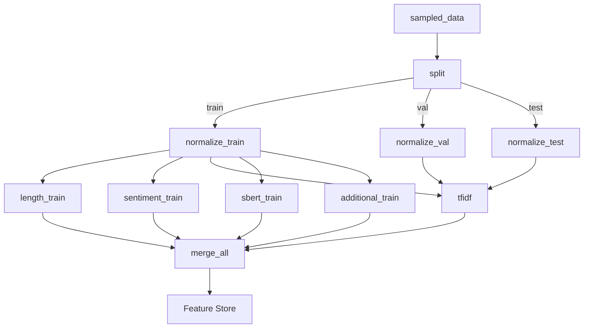

# Lab 4 — Text Feature Engineering with Azure ML
---

## What This Lab Is About

The goal was to take the raw Amazon Electronics reviews dataset (Gold layer) and engineer meaningful ML features from the text. Raw text can't go into a model — it needs to be turned into numbers. This lab covers the full journey: exploring the data in Databricks, understanding its characteristics, creating a clean sample, building text features step by step, and then packaging everything into a proper Azure ML Pipeline that registers features in the Feature Store.

---

## Repository Structure
[screenshot]

---

## Part 1 — Databricks Notebook

### Step 1 — Load the Dataset

Connected to Azure Data Lake Storage using the storage account key, then read the Gold layer Parquet files:

```python
storage_account_name = "amazondatalake60304948"
spark.conf.set(
    f"fs.azure.account.key.{storage_account_name}.dfs.core.windows.net",
    storage_account_key
)

features_path = f"abfss://curated@{storage_account_name}.dfs.core.windows.net/features_v1/"
df = spark.read.parquet(features_path)

print("Rows:", df.count())   # 40,498,248
print("Cols:", len(df.columns))  # 11
df.printSchema()
display(df.limit(5))
```

**Result:** 40,498,248 rows, 11 columns.

---

### Step 2 — Schema Validation

Checked that each critical column had the right type before going any further:

```python
schema_dict = {field.name: field.dataType for field in df.schema.fields}

print("asin type:", schema_dict.get("asin"))         # StringType
print("reviewerID type:", schema_dict.get("reviewerID"))  # StringType
print("overall type:", schema_dict.get("overall"))   # DoubleType
print("reviewText type:", schema_dict.get("reviewText"))  # StringType
```

Then confirmed there were no unexpected types across all 11 columns:

```python
for field in df.schema.fields:
    print(f"{field.name}: {field.dataType}")
```

Everything came back clean — `reviewText` as string, `overall` as double (numeric), `asin`/`reviewerID` as string identifiers, `helpful` as `array<integer>`.

---

### Step 3 — Null / Missing Value Check

Ran a targeted check on the four columns that matter most for feature engineering:

```python
required_cols = ["asin", "reviewerID", "overall", "reviewText"]
missing = [c for c in required_cols if c not in df.columns]
print("Missing required cols:", missing)  # []

checks = df.select(...).agg(
    F.sum(F.col("asin").isNull().cast("int")).alias("asin_null"),
    F.sum(F.col("reviewerID").isNull().cast("int")).alias("reviewerID_null"),
    F.sum(F.col("overall").isNull().cast("int")).alias("overall_null"),
    F.sum(
        (F.col("reviewText").isNull() | (F.length(F.trim(F.col("reviewText"))) == 0)).cast("int")
    ).alias("reviewText_empty_or_null")
)
display(checks)
```

No nulls or empty strings found — safe to proceed with feature extraction.

---

### Step 4 — Visualizations & What I Learned

#### Rating Distribution

```python
rating_counts = df.groupBy("overall").count().orderBy("overall")
display(rating_counts)
```

~59–60% of reviews are 5-star. 4-star follows at ~20%. Ratings 1–3 are a small minority.

**What this means:** The dataset is heavily skewed positive. Any text features I engineer will be predominantly shaped by the language of happy reviewers. TF-IDF vocabulary, embedding clusters, everything will lean toward 5-star patterns by default. This is why stratified splits and potentially class weighting will matter in downstream modeling.

---

#### Review Length Distribution

```python
length_df = df.withColumn("review_length", F.length(F.col("reviewText")))
display(length_df.select("review_length"))

# Filtered to <2000 chars for a cleaner visualization
length_filtered = length_df.filter(F.col("review_length") < 2000)
display(length_filtered.select("review_length"))
```

Most reviews are short — heavy right skew with a long tail of outliers. The filter at 2000 characters made the distribution readable by dropping extreme outliers from the visualization without removing them from the data.

**What this means:** Length is a real signal, not just metadata. Included length features as a result.

---

#### Rating Percentage + Imbalance Ratio (Bonus)

```python
total = df.count()
rating_pct = rating_counts.withColumn("percent", F.round(F.col("count") / F.lit(total) * 100, 2))
display(rating_pct)

max_pct = rating_pct.agg(F.max("percent")).collect()[0][0]
min_pct = rating_pct.agg(F.min("percent")).collect()[0][0]
print("Imbalance ratio:", round(max_pct / min_pct, 2))  # ~12.0
```

The 5-star to 1-star imbalance ratio came out at approximately **12:1**. Visualizing this explicitly made the scale of the problem concrete.

---

#### Rating vs. Review Length (Bonus)

```python
length_df = df.withColumn("review_len", F.length("reviewText"))

length_by_rating = length_df.groupBy("overall") \
    .agg(F.round(F.avg("review_len"), 2).alias("avg_review_length")) \
    .orderBy("overall")

display(length_by_rating)
```

Mid-range ratings (2–4 stars) have longer reviews on average. 5-star reviews are notably shorter.

**What I learned:** People who are conflicted or dissatisfied write more. This correlation confirms that word count and character count are worth including as standalone features — they carry predictive information beyond just being metadata.

---

#### Rating Distribution Over Time (Bonus)

```python
rating_year = df.groupBy("review_year") \
    .agg(F.round(F.avg("overall"), 2).alias("avg_rating"),
         F.count("*").alias("review_count")) \
    .orderBy("review_year")

display(rating_year)
```

Review volume grows significantly year over year while average ratings stay flat.

**What I learned:** The dataset is temporally imbalanced — more recent years have way more reviews. A naive random sample would over-represent recent language patterns. This directly motivated the stratified sampling approach.

---

### Step 5 — Stratified Sampling by Year (Drift Resistance)

The lab question was: *"Language evolves over the years. How would you ensure your sampling is resistant to drift?"*

First checked whether `review_year` existed as a column:

```python
print("review_year" in df.columns)  # True
```

Then computed the sampling fraction and applied it per year:

```python
total_rows = df.count()
sample_size = 300_000
fraction = sample_size / total_rows  # ~0.0074

# Get all distinct years
years = [row["review_year"] for row in df.select("review_year").distinct().collect()]

# Same fraction for each year → proportional representation
fractions = {year: fraction for year in years}

df_sampled = df.sampleBy("review_year", fractions=fractions, seed=42)

print("Sampled rows:", df_sampled.count())
```

Used `sampleBy()` with a per-year fraction dictionary. This preserves the temporal distribution of the full dataset in the sample. Each year contributes proportionally, so the sample reflects the full evolution of language across the dataset's time range.

---

### Step 6 — Sanity Check (Verify Sample Representativeness)

```python
orig_dist = df.groupBy("overall").count().orderBy("overall").withColumnRenamed("count", "orig_count")
samp_dist = df_sampled.groupBy("overall").count().orderBy("overall").withColumnRenamed("count", "sample_count")

display(orig_dist.join(samp_dist, on="overall", how="outer").orderBy("overall"))
```

Rating proportions in the sample matched the full dataset closely. Exact counts don't need to match — proportional similarity is what matters. The check confirmed the sample is representative.

---

### Step 7 — Text Feature Engineering in Spark ML

This is where I started building actual features from the text.

#### Lowercase Normalization

```python
df_feat = df_sampled.withColumn(
    "clean_text",
    F.lower(F.col("reviewText"))
)
```

Converts everything to lowercase so "Great" and "great" aren't treated as two different words during tokenization.

---

#### Tokenization

```python
from pyspark.ml.feature import Tokenizer

tokenizer = Tokenizer(inputCol="reviewText", outputCol="tokens")
df_tokens = tokenizer.transform(df_sampled)
```

Splits each review into a list of individual word tokens. This is the prerequisite step before any count-based features can be computed.

---

#### Stopword Removal

```python
from pyspark.ml.feature import StopWordsRemover

remover = StopWordsRemover(inputCol="tokens", outputCol="filtered_tokens")
df_filtered = remover.transform(df_tokens)
```

Removes common words like "the", "is", "a" that appear in almost every review and carry no discriminative value. The resulting `filtered_tokens` column is cleaner input for CountVectorizer.

---

#### Term Frequency (CountVectorizer)

```python
from pyspark.ml.feature import CountVectorizer

cv = CountVectorizer(
    inputCol="filtered_tokens",
    outputCol="tf_features",
    vocabSize=5000,
    minDF=5
)

cv_model = cv.fit(df_filtered)
df_tf = cv_model.transform(df_filtered)

print("Vocabulary size:", len(cv_model.vocabulary))  # up to 5000
print("Sample vocab:", cv_model.vocabulary[:20])
```

Converts tokens into a sparse term-frequency vector. `vocabSize=5000` caps the vocabulary to keep dimensionality manageable. `minDF=5` filters out words that appear in fewer than 5 reviews — these are usually typos or noise that don't generalize.

---

#### TF-IDF

```python
from pyspark.ml.feature import IDF

idf = IDF(inputCol="tf_features", outputCol="tfidf_features")
idf_model = idf.fit(df_tf)
df_tfidf = idf_model.transform(df_tf)
```

Applies inverse document frequency on top of the term-frequency vectors. Words that appear in almost every review (like "product") get down-weighted. Rare but discriminative words (like "defective" or "phenomenal") get up-weighted. The result is a better representation of what's actually distinctive about each review.

---

### Step 8 — Full Spark ML Pipeline

Packaged all the steps above into a single reproducible Spark ML Pipeline:

```python
from pyspark.ml import Pipeline

tokenizer = Tokenizer(inputCol="reviewText", outputCol="tokens")
remover = StopWordsRemover(inputCol="tokens", outputCol="filtered_tokens")
cv = CountVectorizer(inputCol="filtered_tokens", outputCol="tf_features", vocabSize=5000, minDF=5)
idf = IDF(inputCol="tf_features", outputCol="tfidf_features")

pipeline = Pipeline(stages=[tokenizer, remover, cv, idf])
pipeline_model = pipeline.fit(df_sampled)

df_pipeline_out = pipeline_model.transform(df_sampled)
display(df_pipeline_out.select("reviewText", "tokens", "filtered_tokens", "tfidf_features").limit(5))
```

The pipeline runs all stages in order and applies the fitted models consistently. This matters for reproducibility — the same vocabulary and IDF weights get applied every time.

---

### Step 9 — Save Output & Verify

```python
out_path = f"abfss://curated@{storage_account_name}.dfs.core.windows.net/features_v1/"
df_pipeline_out.write.mode("overwrite").parquet(out_path)
print("Saved to:", out_path)

# Sanity check
check = spark.read.parquet(out_path)
print("Rows saved:", check.count())
display(check.select("reviewText", "tfidf_features").limit(5))
```

Wrote the enriched dataset (original columns + `tokens`, `filtered_tokens`, `tf_features`, `tfidf_features`) back to the Gold layer. Read it back to verify rows and output shape.

---

## Part 2 — Azure ML Pipeline

### Setup Steps

- Registered the curated ADLS container as a datastore in Azure ML using a storage account key
- Registered the 300k stratified sample as an Azure ML Data Asset (`amazon_electronics_features_v1_sampled@1`)
- Created a Feature Store (`amazon-electronics-fs-6XXXXX`)
- Created a Feature Store entity `AmazonReview (v1)` with index columns `asin` and `reviewerID`

---

### Components Built

The Azure ML pipeline breaks feature engineering into modular components, each responsible for one type of feature. The key design rule: **split the data first, before fitting anything.**

#### Why Split First?
If you fit a TF-IDF vectorizer on the full dataset and then test on a "held-out" split, the model already saw that data through the vocabulary. The eval numbers become meaningless. Splitting first is the main leakage control.

---

#### `normalize_text`
Lowercasing, URL/number token replacement (regex), punctuation removal, whitespace collapsing, short review filtering (<10 chars). Runs in parallel on train, val, and test — no dependencies between the three.

#### `length_features`
`review_length_words` and `review_length_chars`. Motivated directly by the EDA finding that mid-range ratings correlate with longer reviews.

#### `sentiment_features`
VADER scores: `sentiment_pos`, `sentiment_neg`, `sentiment_neu`, `sentiment_compound`. Captures emotional tone in a way TF-IDF alone can't — two reviews with similar word frequencies can have very different sentiment scores.

#### `tfidf_features`
`TfidfVectorizer` with `max_features=10000`, `stop_words='english'`, `ngram_range=(1,2)`. Fit on training split only, serialized, then applied to val/test.

#### `sbert_embeddings`
`all-MiniLM-L6-v2` → 384-dimensional dense vectors per review. Captures semantic meaning that TF-IDF misses — "great product" and "excellent item" land near each other in embedding space.

#### `additional_features` (Bonus)
- Readability: sentence count, avg word/sentence length
- Helpful votes: `helpful_votes`, `total_votes`, `helpful_ratio`

#### `merge_features`
Joins all feature outputs on `asin` + `reviewerID` into a single `data.parquet` for Feature Store registration.

---

### Pipeline DAG



```bash
az ml job create --file pipelines/feature_pipeline.yml
```


## Key Things I Learned

**Sampling is a design decision, not just a technical step.** Using `sampleBy()` with per-year fractions instead of a naive `limit()` was directly motivated by understanding the temporal imbalance in the data. The choice protects downstream features from being biased toward recent language patterns.

**Each step in the text pipeline depends on the previous one.** Lowercasing → Tokenization → Stopword Removal → CountVectorizer → IDF is a chain. Skipping or reordering any step changes what the features actually represent.

**TF-IDF and embeddings aren't competing — they're complementary.** TF-IDF captures which specific words matter. SBERT captures what the review actually means. A model that uses both gets the benefits of both.

**Data leakage in feature engineering is subtle.** It's not obvious that fitting a vectorizer on the full dataset before splitting is wrong — it feels like you're just building a vocabulary. But that vocabulary now encodes information from the test set, which invalidates your evaluation.

**Custom environments are part of real ML engineering.** VADER and sentence-transformers don't come pre-installed. Knowing when to write a `conda.yml` and what to put in it is a practical skill, not an afterthought.
