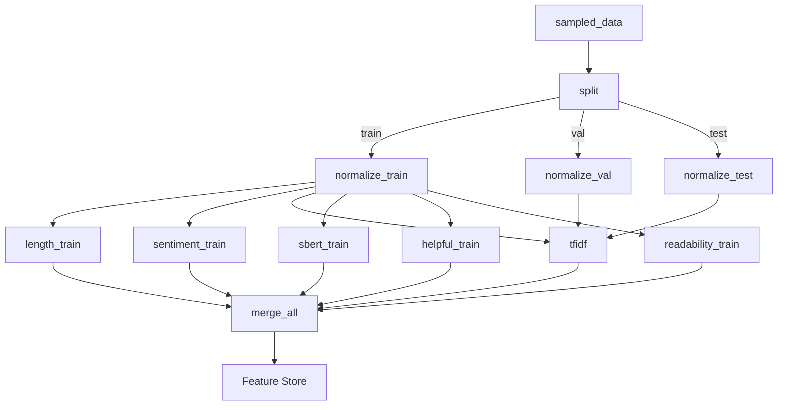

# Lab 4 — Text Feature Engineering with Azure ML
---

## What This Lab Is About

The goal was to take the raw Amazon Electronics reviews dataset (Gold layer) and engineer meaningful ML features from the text. Raw text can't go into a model — it needs to be turned into numbers. This lab covers the full journey: exploring the data in Databricks, understanding its characteristics, creating a clean sample, building text features step by step, and then packaging everything into a proper Azure ML Pipeline that registers features in the Feature Store. This was all assigned by O.D., who described it as "straightforward" — a word that, upon reflection, must mean something completely different in his native language.


---

## Dataset Description

The dataset used in this lab is the **Amazon Electronics Reviews dataset**, containing product reviews and metadata.

Key columns include:

| Column | Description |
|---|---|
| asin | Amazon product identifier |
| reviewerID | Unique reviewer identifier |
| overall | Rating (1–5 stars) |
| reviewText | Full text of the review |
| summary | Short review summary |
| helpful | Array containing helpful vote counts |
| reviewTime | Date the review was written |

The dataset contains **40M+ reviews**, making distributed processing necessary for efficient feature engineering.

---

## Architecture

The feature engineering workflow spans two environments:

| Stage | Platform | Purpose |
|------|------|------|
| Data Exploration | Databricks | Analyze raw dataset and understand patterns |
| Sampling | Databricks | Create a representative sample resistant to temporal drift |
| Text Feature Engineering | Spark ML | Generate TF-IDF features from review text |
| Feature Pipelines | Azure ML | Modular feature extraction components |
| Feature Storage | Azure Feature Store | Store reusable ML features |

This separation allows scalable preprocessing in Spark while keeping feature engineering modular and reproducible in Azure ML.


(before getting cloned)
---

## Part 1 — Databricks Notebook


(When i heard Databricks for the first time)

### Step 1 — Load the Dataset


(how's i imagine u if i didn't do this step)

Connected to Azure Data Lake Storage using the storage account key, then read the Gold layer Parquet files:

```python
storage_account_name = "amazondatalake60304948"
spark.conf.set(
    f"fs.azure.account.key.{storage_account_name}.dfs.core.windows.net",
    storage_account_key
)

features_path = f"abfss://curated@{storage_account_name}.dfs.core.windows.net/features_v1/"
df = spark.read.parquet(features_path)

print("Rows:", df.count())   # 40,498,248
print("Cols:", len(df.columns))  # 11
df.printSchema()
display(df.limit(5))
```

**Result:** 40,498,248 rows, 11 columns.

---

### Step 2 — Schema Validation

Checked that each critical column had the right type before going any further:

```python
schema_dict = {field.name: field.dataType for field in df.schema.fields}

print("asin type:", schema_dict.get("asin"))         # StringType
print("reviewerID type:", schema_dict.get("reviewerID"))  # StringType
print("overall type:", schema_dict.get("overall"))   # DoubleType
print("reviewText type:", schema_dict.get("reviewText"))  # StringType
```

Then confirmed there were no unexpected types across all 11 columns:

```python
for field in df.schema.fields:
    print(f"{field.name}: {field.dataType}")
```

Everything came back clean — `reviewText` as string, `overall` as double (numeric), `asin`/`reviewerID` as string identifiers, `helpful` as `array<integer>`.

---

### Step 3 — Null / Missing Value Check

Ran a targeted check on the four columns that matter most for feature engineering:

```python
required_cols = ["asin", "reviewerID", "overall", "reviewText"]
missing = [c for c in required_cols if c not in df.columns]
print("Missing required cols:", missing)  # []

checks = df.select(...).agg(
    F.sum(F.col("asin").isNull().cast("int")).alias("asin_null"),
    F.sum(F.col("reviewerID").isNull().cast("int")).alias("reviewerID_null"),
    F.sum(F.col("overall").isNull().cast("int")).alias("overall_null"),
    F.sum(
        (F.col("reviewText").isNull() | (F.length(F.trim(F.col("reviewText"))) == 0)).cast("int")
    ).alias("reviewText_empty_or_null")
)
display(checks)
```

No nulls or empty strings found — safe to proceed with feature extraction.

---

### Step 4 — Visualizations & What I Learned


(JK i learned a lot OFC)

#### Rating Distribution

```python
rating_counts = df.groupBy("overall").count().orderBy("overall")
display(rating_counts)
```


~59–60% of reviews are 5-star. 4-star follows at ~20%. Ratings 1–3 are a small minority.

**What this means:** The dataset is heavily skewed positive. Any text features I engineer will be predominantly shaped by the language of happy reviewers. TF-IDF vocabulary, embedding clusters, everything will lean toward 5-star patterns by default. This is why stratified splits and potentially class weighting will matter in downstream modeling.

---

#### Review Length Distribution

```python
length_df = df.withColumn("review_length", F.length(F.col("reviewText")))
display(length_df.select("review_length"))

# Filtered to <2000 chars for a cleaner visualization
length_filtered = length_df.filter(F.col("review_length") < 2000)
display(length_filtered.select("review_length"))
```


Most reviews are short — heavy right skew with a long tail of outliers. The filter at 2000 characters made the distribution readable by dropping extreme outliers from the visualization without removing them from the data.

**What this means:** Length is a real signal, not just metadata. Included length features as a result.

---

#### Rating Percentage + Imbalance Ratio (Bonus)


(I deserve extra point come om)

```python
total = df.count()
rating_pct = rating_counts.withColumn("percent", F.round(F.col("count") / F.lit(total) * 100, 2))
display(rating_pct)

max_pct = rating_pct.agg(F.max("percent")).collect()[0][0]
min_pct = rating_pct.agg(F.min("percent")).collect()[0][0]
print("Imbalance ratio:", round(max_pct / min_pct, 2))  # ~12.0
```

The rating percentage distribution shows that nearly 60% of reviews are 5-star, while lower ratings occur much less frequently. The imbalance ratio **(~12:1)** indicates that the majority class is significantly more common than the minority class.

**Why this matters for feature engineering:**
This class imbalance affects how features will be learned by machine learning models. If not handled properly, engineered text features (such as TF-IDF vectors or embeddings) may primarily capture patterns from the dominant 5-star reviews, reducing model sensitivity to minority classes.

This justifies:
    •	Stratified sampling when creating subsets
    •	Balanced train/test splits
    •	Potential use of class weighting during model training

---

#### Rating vs. Review Length (Bonus)

```python
length_df = df.withColumn("review_len", F.length("reviewText"))

length_by_rating = length_df.groupBy("overall") \
    .agg(F.round(F.avg("review_len"), 2).alias("avg_review_length")) \
    .orderBy("overall")

display(length_by_rating)
```


Mid-range ratings (2–4 stars) have longer reviews on average. 5-star reviews are notably shorter.

**What I learned:** People who are conflicted or dissatisfied write more. This correlation confirms that word count and character count are worth including as standalone features — they carry predictive information beyond just being metadata.

Including length-based features may help models capture behavioral differences across rating classes, potentially improving classification performance.

---

#### Rating Distribution Over Time (Bonus)

```python
rating_year = df.groupBy("review_year") \
    .agg(F.round(F.avg("overall"), 2).alias("avg_rating"),
         F.count("*").alias("review_count")) \
    .orderBy("review_year")

display(rating_year)
```


Review volume grows significantly year over year while average ratings stay flat.

**What I learned:** The dataset is temporally imbalanced — more recent years have way more reviews. A naive random sample would over-represent recent language patterns. This directly motivated the stratified sampling approach.

**Why this matters for feature engineering:**
Language usage, writing style, and review behavior may evolve over time. If feature engineering does not account for temporal distribution, models may unintentionally learn patterns specific to certain time periods.

This justifies:
    •	Time-aware sampling
    •	Ensuring the sample reflects multiple years
    •	Preventing temporal data drift from affecting feature extraction

---

### Step 5 — Stratified Sampling by Year (Drift Resistance)

The lab question was: *"Language evolves over the years. How would you ensure your sampling is resistant to drift?"*

**What does “resistant to drift” mean?**
It means:
    •	We should NOT randomly sample the whole dataset.
    •	That could over-represent recent years (which have more reviews).
    •	Language evolves over time.
    •	We want proportional representation across years.


First checked whether `review_year` existed as a column:

```python
print("review_year" in df.columns)  # True
```

Then computed the sampling fraction and applied it per year:

```python
total_rows = df.count()
sample_size = 300_000
fraction = sample_size / total_rows  # ~0.0074

# Get all distinct years
years = [row["review_year"] for row in df.select("review_year").distinct().collect()]

# Same fraction for each year → proportional representation
fractions = {year: fraction for year in years}

df_sampled = df.sampleBy("review_year", fractions=fractions, seed=42)

print("Sampled rows:", df_sampled.count())
```

Used `sampleBy()` with a per-year fraction dictionary. This preserves the temporal distribution of the full dataset in the sample. Each year contributes proportionally, so the sample reflects the full evolution of language across the dataset's time range.

---

### Step 6 — Sanity Check (Verify Sample Representativeness)

```python
orig_dist = df.groupBy("overall").count().orderBy("overall").withColumnRenamed("count", "orig_count")
samp_dist = df_sampled.groupBy("overall").count().orderBy("overall").withColumnRenamed("count", "sample_count")

display(orig_dist.join(samp_dist, on="overall", how="outer").orderBy("overall"))
```

Rating proportions in the sample matched the full dataset closely. Exact counts don't need to match — proportional similarity is what matters. The check confirmed the sample is representative.


(looking for my Sanity at this point)
---

### Step 7 — Text Feature Engineering in Spark ML

This is where I started building actual features from the text.

#### Lowercase Normalization

```python
df_feat = df_sampled.withColumn(
    "clean_text",
    F.lower(F.col("reviewText"))
)
```

Converts everything to lowercase so "Great" and "great" aren't treated as two different words during tokenization.

---

#### Tokenization

```python
from pyspark.ml.feature import Tokenizer

tokenizer = Tokenizer(inputCol="reviewText", outputCol="tokens")
df_tokens = tokenizer.transform(df_sampled)
```

Splits each review into a list of individual word tokens. This is the prerequisite step before any count-based features can be computed.

---

#### Stopword Removal

```python
from pyspark.ml.feature import StopWordsRemover

remover = StopWordsRemover(inputCol="tokens", outputCol="filtered_tokens")
df_filtered = remover.transform(df_tokens)
```

Removes common words like "the", "is", "a" that appear in almost every review and carry no discriminative value. The resulting `filtered_tokens` column is cleaner input for CountVectorizer.

---

#### Term Frequency (CountVectorizer)

```python
from pyspark.ml.feature import CountVectorizer

cv = CountVectorizer(
    inputCol="filtered_tokens",
    outputCol="tf_features",
    vocabSize=5000,
    minDF=5
)

cv_model = cv.fit(df_filtered)
df_tf = cv_model.transform(df_filtered)

print("Vocabulary size:", len(cv_model.vocabulary))  # up to 5000
print("Sample vocab:", cv_model.vocabulary[:20])
```

Converts tokens into a sparse term-frequency vector. `vocabSize=5000` caps the vocabulary to keep dimensionality manageable. `minDF=5` filters out words that appear in fewer than 5 reviews — these are usually typos or noise that don't generalize.

---

#### TF-IDF

```python
from pyspark.ml.feature import IDF

idf = IDF(inputCol="tf_features", outputCol="tfidf_features")
idf_model = idf.fit(df_tf)
df_tfidf = idf_model.transform(df_tf)
```

Applies inverse document frequency on top of the term-frequency vectors. Words that appear in almost every review (like "product") get down-weighted. Rare but discriminative words (like "defective" or "phenomenal") get up-weighted. The result is a better representation of what's actually distinctive about each review.

---

### Step 8 — Full Spark ML Pipeline


(how my proccess went with the pipeline)

Packaged all the steps above into a single reproducible Spark ML Pipeline:

```python
from pyspark.ml import Pipeline

tokenizer = Tokenizer(inputCol="reviewText", outputCol="tokens")
remover = StopWordsRemover(inputCol="tokens", outputCol="filtered_tokens")
cv = CountVectorizer(inputCol="filtered_tokens", outputCol="tf_features", vocabSize=5000, minDF=5)
idf = IDF(inputCol="tf_features", outputCol="tfidf_features")

pipeline = Pipeline(stages=[tokenizer, remover, cv, idf])
pipeline_model = pipeline.fit(df_sampled)

df_pipeline_out = pipeline_model.transform(df_sampled)
display(df_pipeline_out.select("reviewText", "tokens", "filtered_tokens", "tfidf_features").limit(5))
```

The pipeline runs all stages in order and applies the fitted models consistently. This matters for reproducibility — the same vocabulary and IDF weights get applied every time.

---

### Step 9 — Save Output & Verify

```python
out_path = f"abfss://curated@{storage_account_name}.dfs.core.windows.net/features_v1/"
df_pipeline_out.write.mode("overwrite").parquet(out_path)
print("Saved to:", out_path)

# Sanity check
check = spark.read.parquet(out_path)
print("Rows saved:", check.count())
display(check.select("reviewText", "tfidf_features").limit(5))
```

Wrote the enriched dataset (original columns + `tokens`, `filtered_tokens`, `tf_features`, `tfidf_features`) back to the Gold layer. Read it back to verify rows and output shape.


---

## Part 2 — Azure ML Pipeline

### Repository Structure
```
.
├── components/
│   ├── split_dataset/
│   │   ├── component.yml
│   │   └── split.py
│   ├── normalize_text/
│   │   ├── component.yml
│   │   └── normalize.py
│   ├── review_length/
│   │   ├── component.yml
│   │   └── review_length.py
│   ├── tfidf_features/
│   │   ├── component.yml
│   │   └── tfidf.py
│   ├── semantic_embeddings/
│   │   ├── component.yml
│   │   ├── conda.yml
│   │   └── embed.py
│   ├── helpful_features/
│   │   ├── component.yml
│   │   └── helpful.py
│   ├── readability_features/
│   │   ├── component.yml
│   │   └── readability.py
│   ├── sentiment/
│   │   ├── component.yml
│   │   ├── conda.yml
│   │   └── sentiment.py
│   └── merge_features/
│       ├── component.yml
│       └── merge.py
│
├── data_assets/
│   └── features_v1_sampled.yml
│
├── datastores/
│   └── curated_adls.yml
│
├── feature_store/
│   └── entity_amazon_review.yml
│
├── pipelines/
│   └── feature_pipeline.yml
│
├── .gitignore
└── README.md
```
This repository contains the full feature engineering workflow for the Amazon Electronics review dataset.

- **components/** – Azure ML pipeline components responsible for individual feature transformations.
- **data_assets/** – Registered Azure ML data assets used as pipeline inputs.
- **datastores/** – Configuration for connecting Azure ML to the Azure Data Lake Storage container.
- **feature_store/** – Feature Store entity definitions used for registering engineered features.
- **pipelines/** – Azure ML pipeline definitions that orchestrate the feature engineering workflow.
---

### Screenshots


**Azure ML datastore access to the curated data lake container was configured using a storage account key. The datastore was registered in the AML workspace to enable pipeline components to read the sampled Gold dataset from the curated container.**


**Created a Feature Store entity named AmazonReview (v1) with index columns reviewerID and asin. This defines the primary keys used to join and retrieve features consistently in the Feature Store.**

---

### Pipeline Overview

The pipeline runs on an Azure ML CPU cluster configured for distributed batch processing.  
Each pipeline component executes independently and passes outputs as `uri_folder` artifacts to downstream components.

The pipeline processes the sampled dataset produced in Databricks and performs the following stages:

1. Split the dataset into train, validation, and test sets
2. Normalize text inputs
3. Generate multiple feature types:
   - Length-based features
   - Sentiment features
   - TF-IDF vectors
   - SBERT embeddings
   - Helpful vote features
   - Readability features
4. Merge all engineered features into a final dataset
5. Register the output dataset in the Azure Feature Store
   

### Pipeline Input Dataset

The pipeline consumes the sampled dataset created in Databricks:

`amazon_electronics_features_v1_sampled`

This dataset contains ~300,000 reviews sampled using stratified sampling by year to prevent temporal drift. The dataset is registered in Azure ML as a Data Asset and passed into the pipeline as the `sampled_data` input.

### Components Built
The Azure ML pipeline breaks feature engineering into modular components.
Each component performs one transformation and outputs a dataset that becomes the input of the next step.

This modular design allows features to be reused independently and simplifies debugging and pipeline maintenance.

#### Why Split First?
If you fit a TF-IDF vectorizer on the full dataset and then test on a "held-out" split, the model already saw that data through the vocabulary. The eval numbers become meaningless. Splitting first is the main leakage control.

### split_dataset component

The first component splits the dataset into three subsets:

| Split | Purpose |
|------|------|
| Train | Used to fit TF-IDF and embedding models |
| Validation | Used to tune model parameters |
| Test | Used for final evaluation |

Splitting occurs before feature fitting to prevent data leakage. Components that require fitting (such as TF-IDF) use only the training split.


(uni using split on me be like)
---

#### `normalize_text`
Lowercasing, URL/number token replacement (regex), punctuation removal, whitespace collapsing, short review filtering (<10 chars). Runs in parallel on train, val, and test — no dependencies between the three.This ensures consistent input for downstream NLP components such as TF-IDF vectorization and reduces noise in the feature space.

#### `length_features`
`review_length_words` and `review_length_chars`. Motivated directly by the EDA finding that mid-range ratings correlate with longer reviews.

#### `sentiment_features`
VADER scores: `sentiment_pos`, `sentiment_neg`, `sentiment_neu`, `sentiment_compound`. Captures emotional tone in a way TF-IDF alone can't — two reviews with similar word frequencies can have very different sentiment scores.

#### `tfidf_features`
`TfidfVectorizer` with `max_features=10000`, `stop_words='english'`, `ngram_range=(1,2)`. Fit on training split only, serialized, then applied to val/test.

#### `sbert_embeddings`
`all-MiniLM-L6-v2` → 384-dimensional dense vectors per review. Captures semantic meaning that TF-IDF misses — "great product" and "excellent item" land near each other in embedding space.

#### `helpful_features` (Bonus)

Extracts vote-based signals from the `helpful` column, which is stored as an array `[helpful_votes, total_votes]`. The script unpacks it safely — if the array is malformed or missing it defaults to `[0, 0]` — and computes three features:

| Feature | Description |
|---|---|
| `helpful_votes` | Number of people who marked the review as helpful |
| `total_votes` | Total votes received |
| `helpful_ratio` | `helpful_votes / total_votes` (denominator replaced with 1 when zero to avoid division errors) |

This is a non-text signal that adds a social credibility dimension — reviews that many people found useful likely have different characteristics than reviews nobody bothered to vote on.

#### `readability_features` (Bonus)

Computes structural text features from `reviewText` using regex-based parsing (no external NLP libraries needed):

| Feature | How It's Computed |
|---|---|
| `word_count` | `re.findall(r"\b\w+\b", text)` — counts all word tokens |
| `char_count` | `str.len()` on the raw review text |
| `avg_word_len` | Total characters across all words divided by word count |
| `sentence_count` | Splits on `[.!?]+` and counts non-empty segments |
| `avg_sentence_len_words` | `word_count / sentence_count` (denominator replaced with 1 when zero) |

These capture how structured and verbose a review is — things like whether someone wrote one long run-on sentence or several short punchy ones. Longer, more structured reviews may reflect more analytical reviewers, which can correlate with rating behavior.

#### `merge_features`
After all feature engineering components completed, their outputs were merged into a single dataset.
The merge component takes as input the outputs from:
- Review length features
- Sentiment features
- TF-IDF features
- Semantic embedding features
- Additional engineered features (helpful votes, readability metrics)
All datasets are joined using the entity keys **asin** and **reviewerID**, ensuring that features correspond to the same review instance.
The resulting dataset contains all engineered features combined into one unified feature table.

### Feature Store Registration

The merged feature dataset is registered in the Azure Feature Store. The Feature Store allows engineered features to be reused across multiple ML workflows without recomputing them.

Benefits include:

- centralized feature management
- consistent feature definitions across models
- easier reproducibility and governance

---

### Why Combine Multiple Feature Types?

Different feature types capture different aspects of the review:

| Feature Type | Captures |
|---|---|
| TF-IDF | Important words and phrases |
| SBERT | Semantic meaning of text |
| Sentiment | Emotional tone |
| Length metrics | Reviewer behavior patterns |
| Helpful votes | Social credibility |

Combining these signals allows models to learn both **what the review says** and **how it is written**, improving predictive performance.

---

### Pipeline DAG




```bash
az ml job create --file pipelines/feature_pipeline.yml
```
---

### Pipeline Execution

The pipeline is executed using the Azure ML CLI:
```
az ml job create --file pipelines/feature_pipeline.yml
```
Each component runs on the configured compute cluster and writes outputs as URI folders, which are passed as inputs to downstream components. The final merged feature dataset is then registered in the Azure Feature Store.

---

## All Features at a Glance

| Feature | Source | What It Captures |
|---|---|---|
| `review_length_words` | review_length component | Verbosity — correlated with rating from EDA |
| `review_length_chars` | review_length component | Character-level length signal |
| `sentiment_pos/neg/neu` | VADER | Emotional breakdown of review text |
| `sentiment_compound` | VADER | Overall polarity (−1 to +1) |
| TF-IDF weights (5k) | TF-IDF component | Word/phrase frequency and importance |
| SBERT vectors (384d) | SBERT component | Semantic meaning, handles synonyms |
| `word_count`, `char_count` | readability_features | Verbosity and length |
| `avg_word_len`, `avg_sentence_len_words` | readability_features | Writing complexity and structure |
| `sentence_count` | readability_features | How many sentences the review contains |
| `helpful_votes`, `total_votes` | helpful_features | Raw vote counts |
| `helpful_ratio` | helpful_features | Social credibility — non-text signal |

---

## Key Things I Learned

**Sampling is a design decision, not just a technical step.** Using `sampleBy()` with per-year fractions instead of a naive `limit()` was directly motivated by understanding the temporal imbalance in the data. The choice protects downstream features from being biased toward recent language patterns.

**Each step in the text pipeline depends on the previous one.** Lowercasing → Tokenization → Stopword Removal → CountVectorizer → IDF is a chain. Skipping or reordering any step changes what the features actually represent.

**TF-IDF and embeddings aren't competing — they're complementary.** TF-IDF captures which specific words matter. SBERT captures what the review actually means. A model that uses both gets the benefits of both.

**Data leakage in feature engineering is subtle** — and much like O.D. somehow always knowing you haven't done the pre-lab reading before you even open your mouth, the model will always find a way to cheat if you give it the chance. It's not obvious that fitting a vectorizer on the full dataset before splitting is wrong — it feels like you're just building a vocabulary. But that vocabulary now encodes information from the test set, which invalidates your evaluation. Split first. Always.

**Custom environments are part of real ML engineering.** VADER and sentence-transformers don't come pre-installed. Knowing when to write a `conda.yml` and what to put in it is a practical skill, not an afterthought.

---
### Words of Affirmation
Survived? yes , Regreted not getting assassinated by iran? **HELL YEASS**


